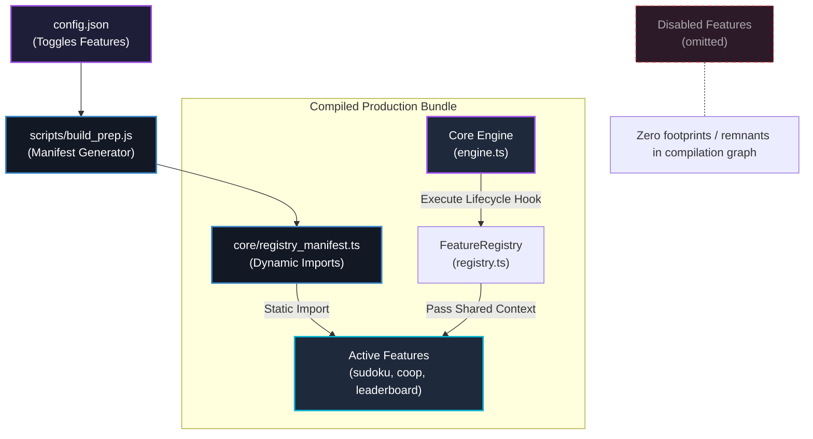
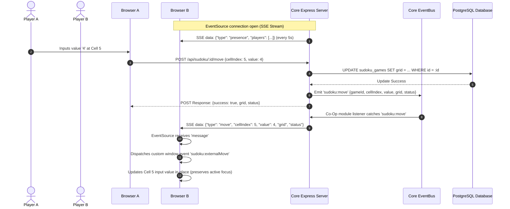
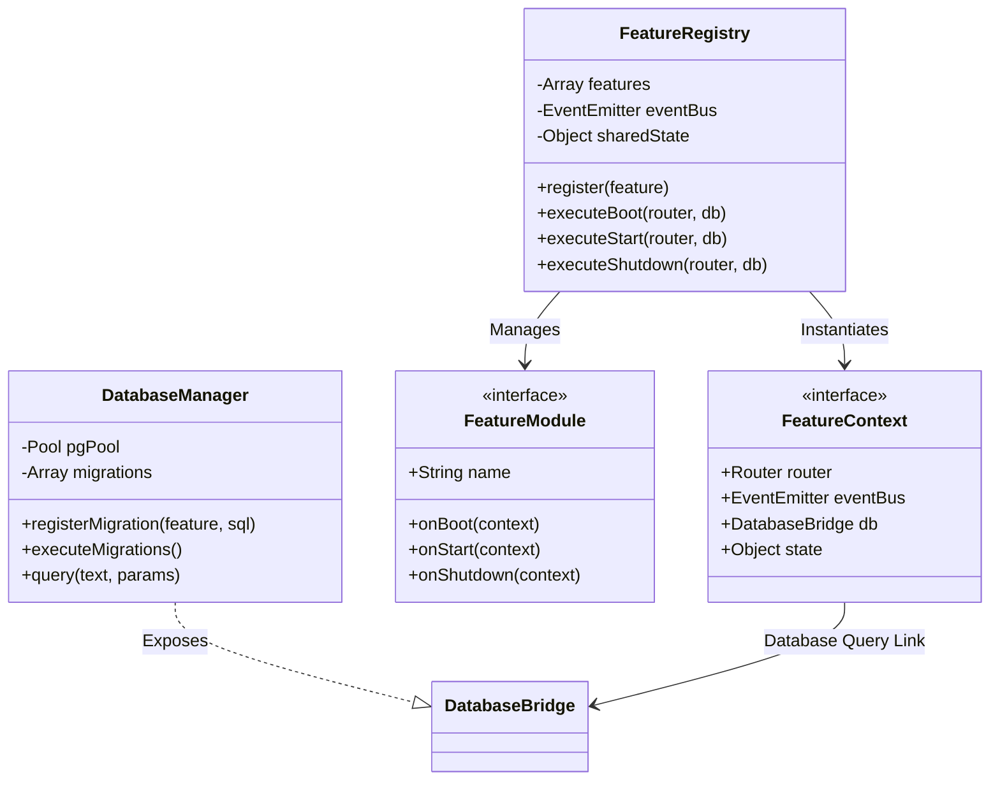
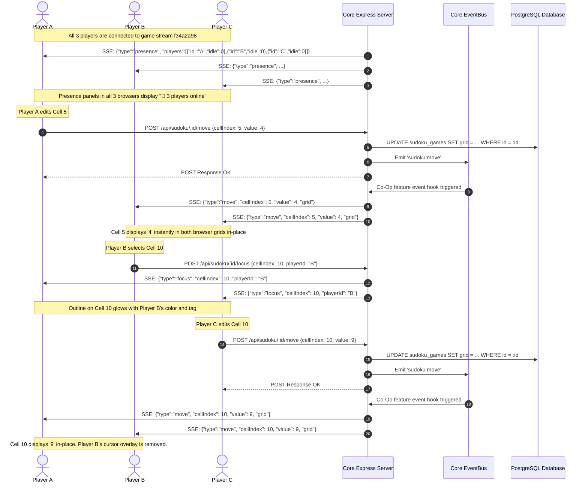

# Architectural Review & Analysis: FAS-Sudoku-App

This document provides a detailed structural analysis of the **FAS-Sudoku-App** and how it adheres to the **Feature-Agent-Spec (FAS)** architecture.

---

## 1. Feature-Agent-Spec (FAS) Alignment

The architecture of `fas-sudoku-app` is split into two distinct, decoupled boundaries:
1.  **The Core Engine (`core/`)**: Agnostic of specific feature modules. It manages database pooling, hooks router contexts, boots lifecycle manifests, and exposes a decoupled EventBus.
2.  **The Sandboxed Features (`features/`)**: Self-contained directories containing feature-specific database schema migrations, client assets (HTML/CSS/JS), and Express route definitions.

### Build-Time Feature Gating & Tree-Shaking
To enforce the **Zero-Remnant Removability** rule, features are registered dynamically at **build-time** using a generator script:

---

## 2. Dynamic Real-Time Sync Topology
The application achieves instant co-op synchronization without persistent socket connections (like WebSockets) by using **Server-Sent Events (SSE)**. 

SSE runs natively on HTTP/1.1 and HTTP/2 (`EventSource` in standard browser API), reducing memory footprint and keeping features decoupled via a global memory `EventBus`.

---

## 3. Component Diagram

The following diagram illustrates the relationship between components during runtime:

---

## 4. Key Architectural Patterns in Play

### In-Place DOM Reconciliation (Client-Side)
To support a high-frequency real-time update flow without using a heavy Virtual DOM library (like React), the front-end `app.js` performs target-specific reconciliation:
1.  On receiving an external move: It queries all cell DOM nodes.
2.  If the input element is the active document focus (`document.activeElement === input`), the modification is skipped locally to prevent cursor jumping/interruptions.
3.  Otherwise, the cell's `input.value` and `conflict` classes are modified directly in-place.
4.  This prevents the deletion of peer focus border overlays, keeping animations smooth.

### Presence and Idle Detection
The presence panel computes player active states statically on the backend:
-   **SSE Stream registration**: Connecting tab appends `playerId` and `nickname` to the stream URL.
-   **Polling cycle**: Every 5 seconds, the server runs a loop over active game connections, calculating `idleSeconds = (Date.now() - lastSeen) / 1000`.
-   **Heartbeats**: The client dispatches a focus-less heartbeat `POST` to `/focus` containing `cellIndex: -2` every 10 seconds. The backend consumes the heartbeat to update `lastSeen` but does not broadcast it to peers.

---

## 5. 3-Player Co-Op Interaction Scenario

This sequence diagram illustrates a case where 3 concurrent browser sessions (Player A, Player B, Player C) are active on the same board:

